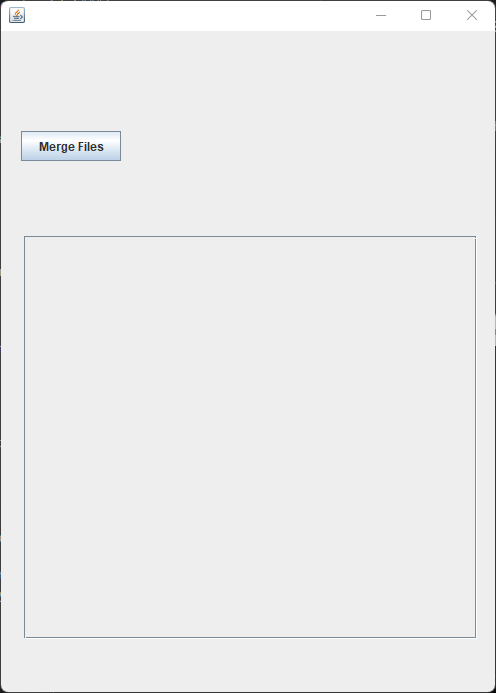
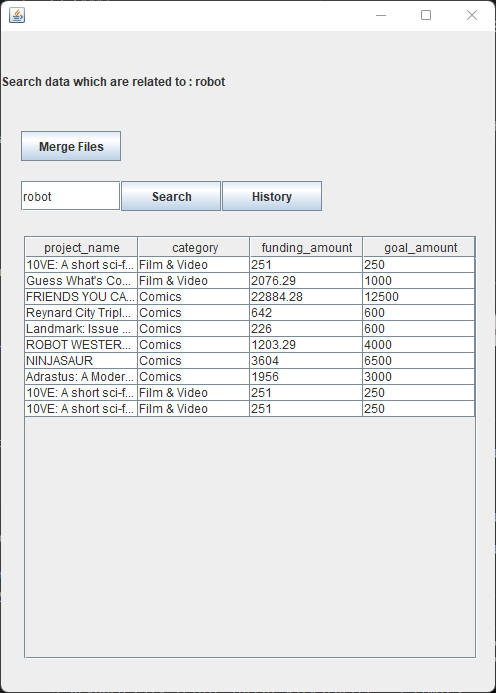
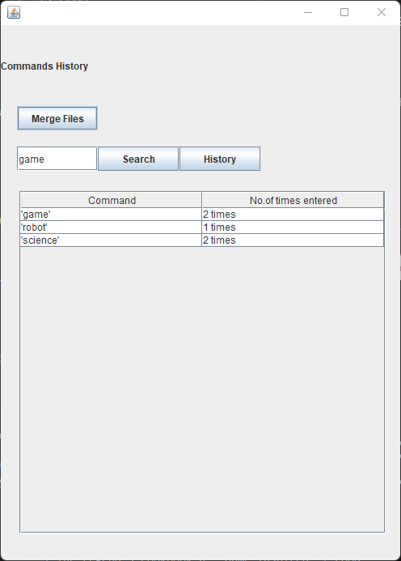

## Requirements

Tested on - `Oracle JDK 8`, `Windows 10 OS`

## Run

Command to start the program on Windows machine. Run it in console/command prompt only.
```
gradlew.bat build   //Build the project
java -jar build\libs\AdvProgAssigTwo-1.0.jar   //Run the application
```

## Description
The application has a swing gui with few components mapped to the assignment functionalities.

### Features - Caching

The file search is cached in memory to avoid researching the data file from hard disk due to IO read.

### Features - Java Swing

The application has a gui to avoid entering data in the console. Execution occurs with single button click.

### Application

- The application initially has 1 button "merge" which combines the files in the data folder to one file "mergedOutput.json".
- After succesful merge 2 buttons and a textfield appears. "Search" button and "History"
- "Search" button will give out the projects list in a table and displays on gui.
- "History" button will show the queries entered

### Images

|Merge|Search|History|
|---|---|---|
||||
